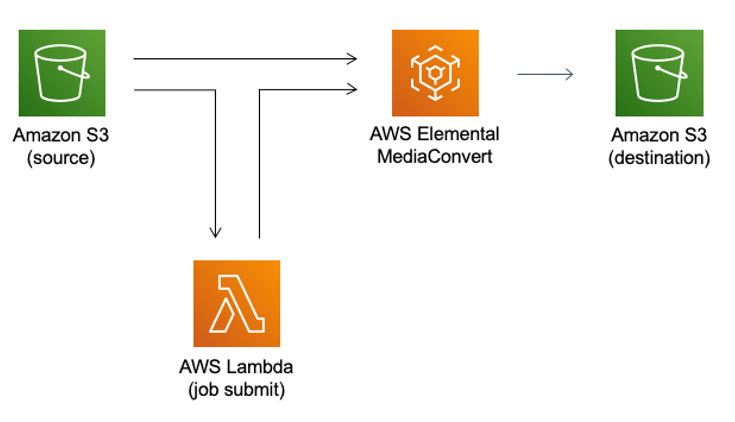
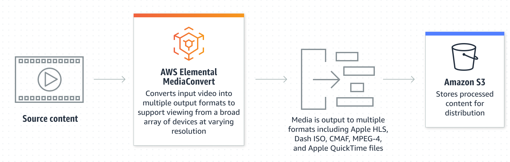
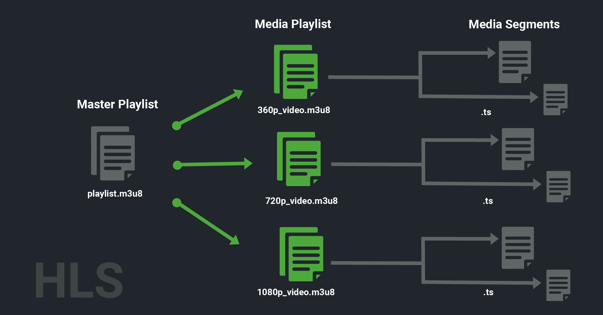
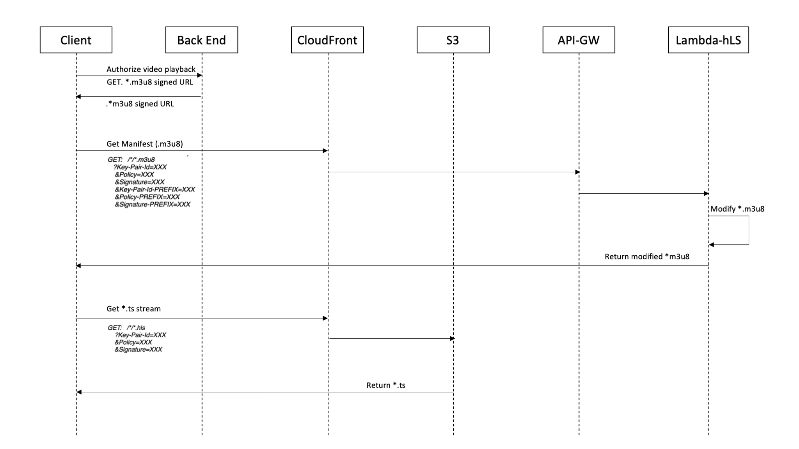

# Architecture

As already mentioned, the architecture is divided into two basic phases:
- the transformation of the videos in a streaming format (phase 1)
- the actual distribution of the videos (phase 2)

PHASE 1

Videos in .mp4 format are placed in a special S3 bucket. A lambda has been connected to the bucket, which collects the inserted videos and triggers a job on the MediaConvert service. AWS Elemental MediaConvert is a file-based video transcoding service with broadcast-grade features. Create live stream content for broadcast and multi-screen delivery at scale.

We are interested in transforming videos from .mp4 format to Apple HLS format, a standard format used for online video distribution. In fact, this format allows you to fragment an initial video into different parts. When a video is requested by the user, it is no longer necessary to send the whole video, only the fragments that he will need at that moment can be sent, as the video continues, all the fragments from which it is composed are recalled.
Thanks to this technique it is possible to considerably reduce the network load placed by a server and therefore to correctly scale the resources according to the use by the users of the service.
If that weren't enough, this technique also allows you to define the quality of the video based on the state of the network. As is well known, the quality of streaming varies depending on the state of the network. If we have a bad connection it will be preferable to arrange the video in a lower format, perhaps in HD and not Full HD, in order to avoid lags. In fact, it is always preferable to reduce the quality of the videos rather than admit the presence of lags.

The HLS format consists of an .m3u8 index file containing the video resolutions, also in .m3u8 format. Each of these directs to a queue of files in .ts format which are the original fragments of our video. The player automatically requests the initial index file and depending on the network status it requests a second index file in .m3u8 with the desired resolution. Once obtained, it requests the various .ts files as the video is projected. If during viewing the network quality changes then automatically the player requests .ts files of another quality.
We could stop here and thus distribute our videos. However this type of streaming service is usually used for a paid platform, where only users with a valid account are able to attend the platform.
Creating a video streaming security system is not a simple thing. AWS provides several techniques to do this, we are going to use the "signed url" technique. As the name suggests, the technique consists in signing each url, or each fragment of our video, with a private key. This key will then be verified by the server, which will have the public key.

PHASE 2

This type of architecture requires several connected microservices, including Cloudfront, API Gateway, S3, and Lambda.
Let’s look at how user request flow as illustrated in figure above works.

    path pattern: *
    Note: Before signing the URL, you want to verify if the user is authorized to watch the requested content. Only if this is the case, you sign the URL and return it back to the client application.
    Client requests a first URL representing a specific file by making API call to the backend. If the user is allowed to see the content then the url is signed and returned.
    
    path pattern: *.m3u8
    Client requests *.m3u8 file, passing custom query params Key-Pair-Id-PREFIX, Policy-PREFIX and Signature-PREFIX.
    CloudFront behavior is matched and request is forwarded to the origin.
    CloudFront makes origin request and passes custom headers.
    API Gateway forwards the request to Lambda that has proxy integration configured with a greedy path variable ({proxy+}). This will allow Lambda function to programmatically identify how to get the manifest from S3 bucket in the next step.
    Lambda function gets the original *.m3u8 manifest file from S3.
    Lambda function modifies the .m3u8 manifest by appending signed URL params to each *.ts file name.
    
    path pattern: *.ts
    Client requests *.ts file, passing query params as part of request URL.
    CloudFront behavior is matched and request is forwarded to the origin.
    CloudFront makes origin request to S3 and returns *.ts file.

[build phase 1](/doc-lms/phase1.md)

[build phase 2](/doc-lms/phase2.md)

[automatization with terraform 3](/doc-lms/terraform.md)