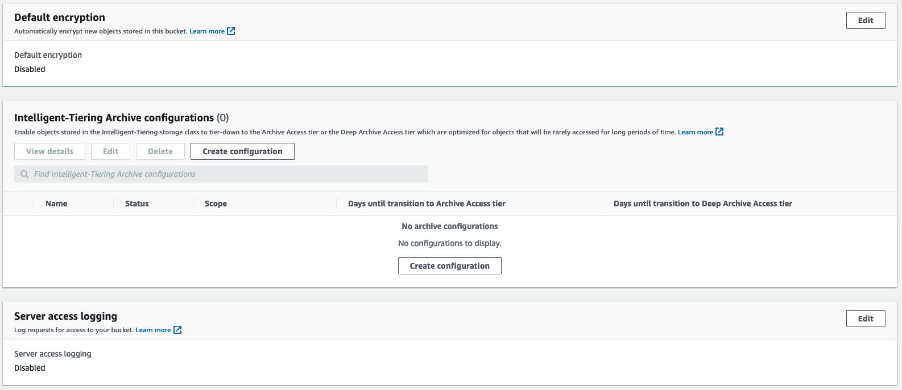
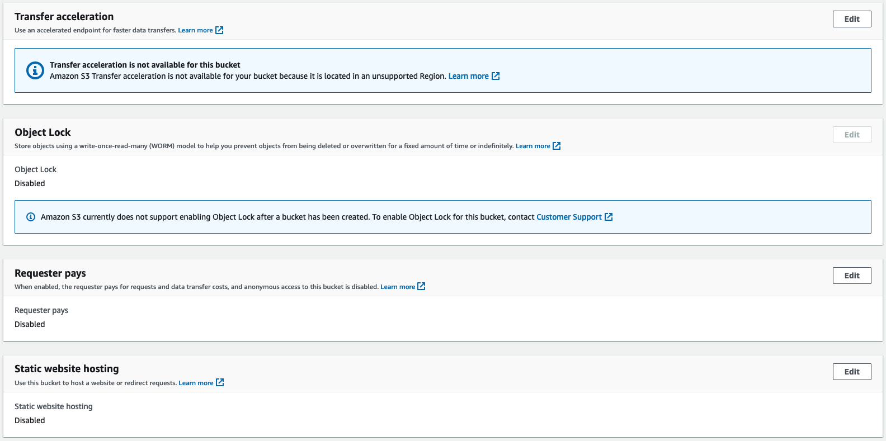
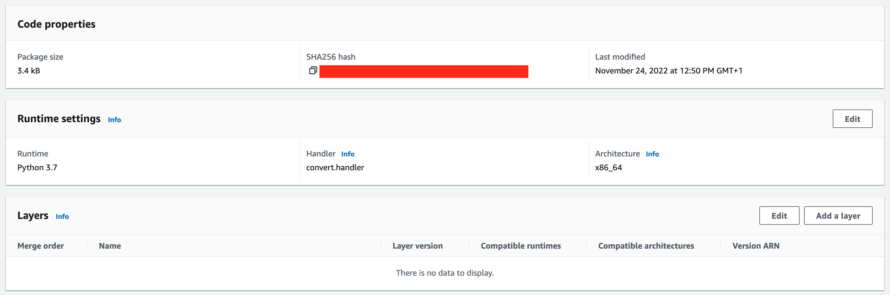

# Architecture

As already mentioned, the architecture is divided into two basic phases:
- the transformation of the videos in a streaming format (phase 1)
- the actual distribution of the videos (phase 2)

PHASE 1

Videos in .mp4 format are placed in a special S3 bucket. A lambda has been connected to the bucket, which collects the inserted videos and triggers a job on the MediaConvert service. AWS Elemental MediaConvert is a file-based video transcoding service with broadcast-grade features. Create live stream content for broadcast and multi-screen delivery at scale.

We are interested in transforming videos from .mp4 format to Apple HLS format, a standard format used for online video distribution. In fact, this format allows you to fragment an initial video into different parts. When a video is requested by the user, it is no longer necessary to send the whole video, only the fragments that he will need at that moment can be sent, as the video continues, all the fragments from which it is composed are recalled.
Thanks to this technique it is possible to considerably reduce the network load placed by a server and therefore to correctly scale the resources according to the use by the users of the service.
If that weren't enough, this technique also allows you to define the quality of the video based on the state of the network. As is well known, the quality of streaming varies depending on the state of the network. If we have a bad connection it will be preferable to arrange the video in a lower format, perhaps in HD and not Full HD, in order to avoid lags. In fact, it is always preferable to reduce the quality of the videos rather than admit the presence of lags.

The HLS format consists of an .m3u8 index file containing the video resolutions, also in .m3u8 format. Each of these directs to a queue of files in .ts format which are the original fragments of our video. The player automatically requests the initial index file and depending on the network status it requests a second index file in .m3u8 with the desired resolution. Once obtained, it requests the various .ts files as the video is projected. If during viewing the network quality changes then automatically the player requests .ts files of another quality.
We could stop here and thus distribute our videos. However this type of streaming service is usually used for a paid platform, where only users with a valid account are able to attend the platform.
Creating a video streaming security system is not a simple thing. AWS provides several techniques to do this, we are going to use the "signed url" technique. As the name suggests, the technique consists in signing each url, or each fragment of our video, with a private key. This key will then be verified by the server, which will have the public key.

PHASE 2

This type of architecture requires several connected microservices, including Cloudfront, API Gateway, S3, and Lambda.
Let’s look at how user request flow as illustrated in figure above works.

    path pattern: *
    Note: Before signing the URL, you want to verify if the user is authorized to watch the requested content. Only if this is the case, you sign the URL and return it back to the client application.
    Client requests a first URL representing a specific file by making API call to the backend. If the user is allowed to see the content then the url is signed and returned.
    
    path pattern: *.m3u8
    Client requests *.m3u8 file, passing custom query params Key-Pair-Id-PREFIX, Policy-PREFIX and Signature-PREFIX.
    CloudFront behavior is matched and request is forwarded to the origin.
    CloudFront makes origin request and passes custom headers.
    API Gateway forwards the request to Lambda that has proxy integration configured with a greedy path variable ({proxy+}). This will allow Lambda function to programmatically identify how to get the manifest from S3 bucket in the next step.
    Lambda function gets the original *.m3u8 manifest file from S3.
    Lambda function modifies the .m3u8 manifest by appending signed URL params to each *.ts file name.
    
    path pattern: *.ts
    Client requests *.ts file, passing query params as part of request URL.
    CloudFront behavior is matched and request is forwarded to the origin.
    CloudFront makes origin request to S3 and returns *.ts file.

# Implementation in AWS
Let's start by implementing the first part of the service (phase 1), i.e. the transformation service of the .mp4 video into an HLS stream. First, we need to declare two buckets. An input bucket where videos in .mp4 format are collected. And an output bucket where the hls streams will be collected.
We will call them input-bucket-terraform-lms-hls-streaming and output-bucket-terraform-lms-hls-streaming.
- input-bucket-terraform-lms-hls-streaming 
    - properties

    
    
    
    

    - permissions

    
    
    

- output-bucket-terraform-lms-hls-streaming
    - properties

    
    
    
    

    - permissions

    
    
    
    

Between these two buckets we find two services which are a Lambda function and MediaConvert. Whenever a video is loaded into the input bucket the Lambda function will be triggered to trigger a job on MediaConvert.
We define a new lambda function, whose code will be as follows:

'''python
    import glob
    import json
    import os
    import uuid
    import boto3
    import datetime
    import random

    from botocore.client import ClientError

    def handler(event, context):

        sourceS3Bucket = event['Records'][0]['s3']['bucket']['name']
        sourceS3Key = event['Records'][0]['s3']['object']['key']
        sourceS3 = 's3://'+ sourceS3Bucket + '/' + sourceS3Key
        sourceS3Basename = os.path.splitext(os.path.basename(sourceS3))[0]
        destinationS3 = 's3://' + os.environ['DestinationBucket']
        destinationS3basename = os.path.splitext(os.path.basename(destinationS3))[0]
        mediaConvertRole = os.environ['MediaConvertRole']
        region = 'us-east-1'
        statusCode = 200
        body = {}
        
        # assetID = str(uuid.uuid4())
        assetID = sourceS3Key
        assetID = assetID.split(".")    # remove .mp4 at the end
        assetID = assetID[0]            # rename the directory with the hash of the file
        
        # Use MediaConvert SDK UserMetadata to tag jobs with the assetID 
        # Events from MediaConvert will have the assetID in UserMedata
        jobMetadata = {'assetID': assetID}

        print (json.dumps(event))
        
        try:
            # Job settings are in the lambda zip file in the current working directory
            with open('job.json') as json_data:
                jobSettings = json.load(json_data)
                print(jobSettings)
            
            # get the account-specific mediaconvert endpoint for this region
            mc_client = boto3.client('mediaconvert', region_name=region)
            endpoints = mc_client.describe_endpoints()

            # add the account-specific endpoint to the client session 
            client = boto3.client('mediaconvert', region_name=region, endpoint_url=endpoints['Endpoints'][0]['Url'], verify=False)

            # Update the job settings with the source video from the S3 event and destination 
            # paths for converted videos
            jobSettings['Inputs'][0]['FileInput'] = sourceS3
            
            S3KeyHLS = 'assets/' + assetID + '/HLS/' + sourceS3Basename
            jobSettings['OutputGroups'][0]['OutputGroupSettings']['HlsGroupSettings']['Destination'] \
                = destinationS3 + '/' + S3KeyHLS
            
            S3KeyWatermark = 'assets/' + assetID + '/MP4/' + sourceS3Basename
            jobSettings['OutputGroups'][1]['OutputGroupSettings']['FileGroupSettings']['Destination'] \
                = destinationS3 + '/' + S3KeyWatermark
            
            S3KeyThumbnails = 'assets/' + assetID + '/Thumbnails/' + sourceS3Basename
            jobSettings['OutputGroups'][2]['OutputGroupSettings']['FileGroupSettings']['Destination'] \
                = destinationS3 + '/' + S3KeyThumbnails     

            print('jobSettings:')
            print(json.dumps(jobSettings))

            # Convert the video using AWS Elemental MediaConvert
            job = client.create_job(Role=mediaConvertRole, UserMetadata=jobMetadata, Settings=jobSettings)
            print (json.dumps(job, default=str))

        except Exception as e:
            print ('Exception: %s' % e)
            statusCode = 500
            raise

        finally:
            return {
                'statusCode': statusCode,
                'body': json.dumps(body),
                'headers': {'Content-Type': 'application/json', 'Access-Control-Allow-Origin': '*'}
            }
'''

The function consists of a first part in which the variables are declared. These variables automatically retrieve the data concerning the bucket and the object that has been inserted, the output bucket is also specified. It is necessary to specify as region for the MediaConvert service 'us-east-1' as this service is not available in all places. The second part specifies the job that must be activated by the function, in particular the job consists in transforming the .mp4 file into the hls format, therefore made up of three levels of indexed files in the .m3u8 and .ts format, as explained before. All the files of the function can be found in the directory "functions/convertMP4".

Here it is necessary to add the input bucket as a trigger, using the appropriate add trigger button

For the service to work it is necessary to define a new role, in particular three permissions must be specified. These permissions give access to the function of operating with S3 and running a Job on MediaConvert. It is also necessary to define a trust relationship to connect the two Lambda and MediaConvert services

It is necessary to set three global variables used by the Lambda function

