# Implementation in AWS

Let's start by implementing the first part of the service (phase 1), i.e. the transformation service of the .mp4 video into an HLS stream. First, we need to declare two buckets. An input bucket (source) where videos in .mp4 format are collected. And an output bucket (destination) where the hls streams will be collected.
We will call them input-bucket-terraform-lms-hls-streaming and output-bucket-terraform-lms-hls-streaming.
- input-bucket-terraform-lms-hls-streaming 
    - properties

    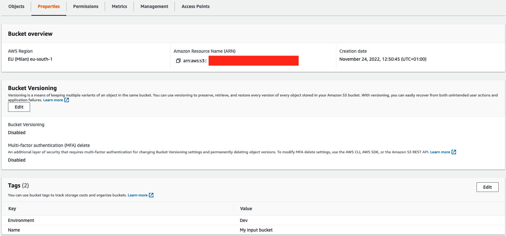
    
    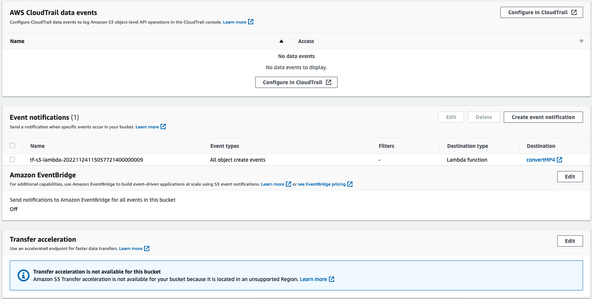
    

    - permissions

    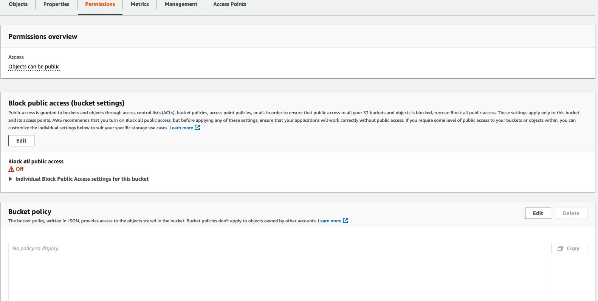
    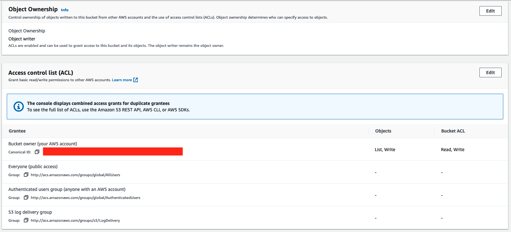
    

- output-bucket-terraform-lms-hls-streaming
    - properties

    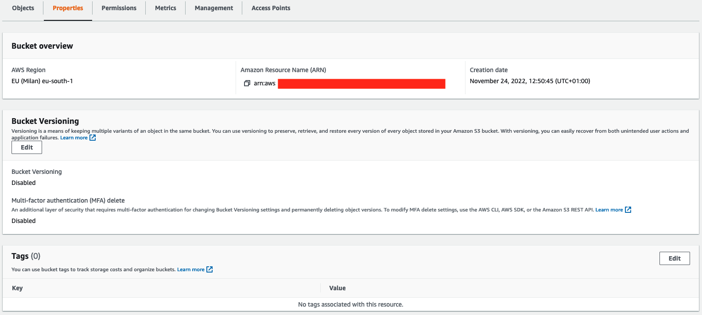
    
    
    

    - permissions

    
    
    
    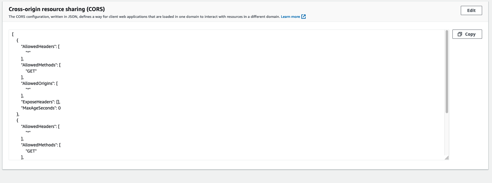

Between these two buckets we find two services which are a Lambda function and MediaConvert. Whenever a video is loaded into the input bucket the Lambda function will be triggered to trigger a job on MediaConvert.
We define a new lambda function, whose code will be as follows:

    import glob
    import json
    import os
    import uuid
    import boto3
    import datetime
    import random

    from botocore.client import ClientError

    def handler(event, context):

        sourceS3Bucket = event['Records'][0]['s3']['bucket']['name']
        sourceS3Key = event['Records'][0]['s3']['object']['key']
        sourceS3 = 's3://'+ sourceS3Bucket + '/' + sourceS3Key
        sourceS3Basename = os.path.splitext(os.path.basename(sourceS3))[0]
        destinationS3 = 's3://' + os.environ['DestinationBucket']
        destinationS3basename = os.path.splitext(os.path.basename(destinationS3))[0]
        mediaConvertRole = os.environ['MediaConvertRole']
        region = 'us-east-1'
        statusCode = 200
        body = {}
        
        # assetID = str(uuid.uuid4())
        assetID = sourceS3Key
        assetID = assetID.split(".")    # remove .mp4 at the end
        assetID = assetID[0]            # rename the directory with the hash of the file
        
        # Use MediaConvert SDK UserMetadata to tag jobs with the assetID 
        # Events from MediaConvert will have the assetID in UserMedata
        jobMetadata = {'assetID': assetID}

        print (json.dumps(event))
        
        try:
            # Job settings are in the lambda zip file in the current working directory
            with open('job.json') as json_data:
                jobSettings = json.load(json_data)
                print(jobSettings)
            
            # get the account-specific mediaconvert endpoint for this region
            mc_client = boto3.client('mediaconvert', region_name=region)
            endpoints = mc_client.describe_endpoints()

            # add the account-specific endpoint to the client session 
            client = boto3.client('mediaconvert', region_name=region, endpoint_url=endpoints['Endpoints'][0]['Url'], verify=False)

            # Update the job settings with the source video from the S3 event and destination 
            # paths for converted videos
            jobSettings['Inputs'][0]['FileInput'] = sourceS3
            
            S3KeyHLS = 'assets/' + assetID + '/HLS/' + sourceS3Basename
            jobSettings['OutputGroups'][0]['OutputGroupSettings']['HlsGroupSettings']['Destination'] \
                = destinationS3 + '/' + S3KeyHLS
            
            S3KeyWatermark = 'assets/' + assetID + '/MP4/' + sourceS3Basename
            jobSettings['OutputGroups'][1]['OutputGroupSettings']['FileGroupSettings']['Destination'] \
                = destinationS3 + '/' + S3KeyWatermark
            
            S3KeyThumbnails = 'assets/' + assetID + '/Thumbnails/' + sourceS3Basename
            jobSettings['OutputGroups'][2]['OutputGroupSettings']['FileGroupSettings']['Destination'] \
                = destinationS3 + '/' + S3KeyThumbnails     

            print('jobSettings:')
            print(json.dumps(jobSettings))

            # Convert the video using AWS Elemental MediaConvert
            job = client.create_job(Role=mediaConvertRole, UserMetadata=jobMetadata, Settings=jobSettings)
            print (json.dumps(job, default=str))

        except Exception as e:
            print ('Exception: %s' % e)
            statusCode = 500
            raise

        finally:
            return {
                'statusCode': statusCode,
                'body': json.dumps(body),
                'headers': {'Content-Type': 'application/json', 'Access-Control-Allow-Origin': '*'}
            }

The function consists of a first part in which the variables are declared. These variables automatically retrieve the data concerning the bucket and the object that has been inserted, the output bucket is also specified. It is necessary to specify as region for the MediaConvert service 'us-east-1' as this service is not available in all places. The second part specifies the job that must be activated by the function, in particular the job consists in transforming the .mp4 file into the hls format, therefore made up of three levels of indexed files in the .m3u8 and .ts format, as explained before. All the files of the function can be found in the directory "functions/convertMP4".

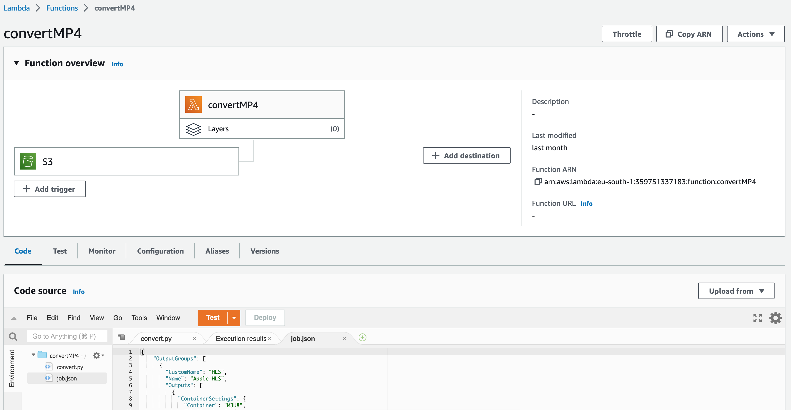

Here it is necessary to add the input bucket as a trigger, using the appropriate add trigger button

For the service to work it is necessary to define a new role, in particular three permissions must be specified. These permissions give access to the function of operating with S3 and running a Job on MediaConvert. It is also necessary to define a trust relationship to connect the two Lambda and MediaConvert services

It is necessary to set three global variables used by the Lambda function

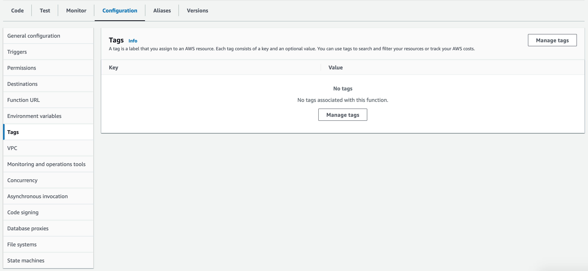

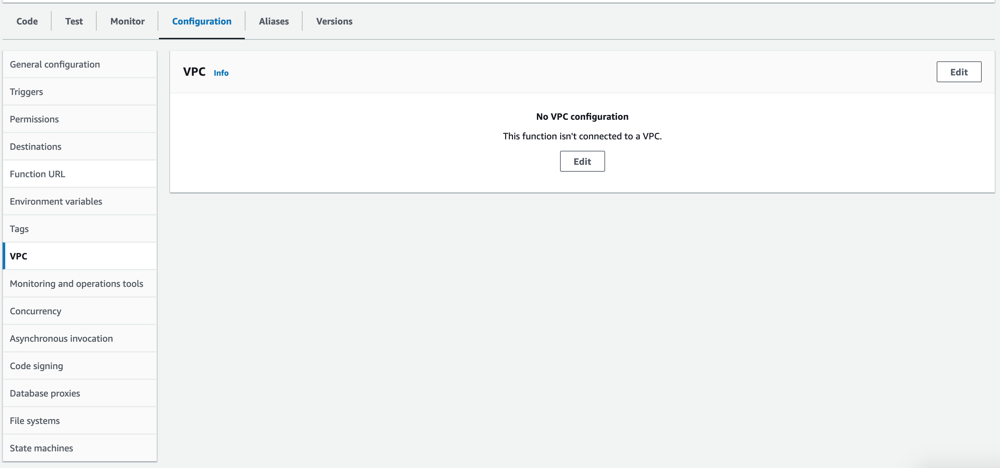

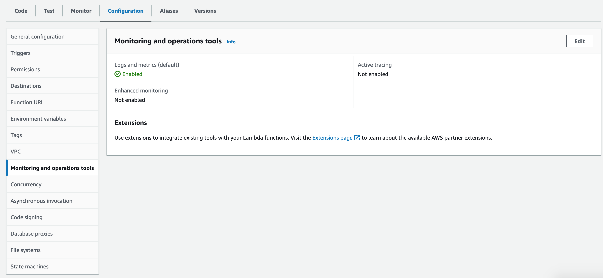

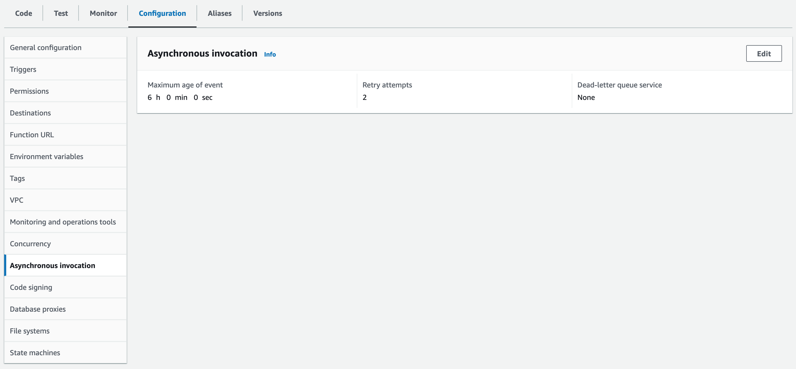

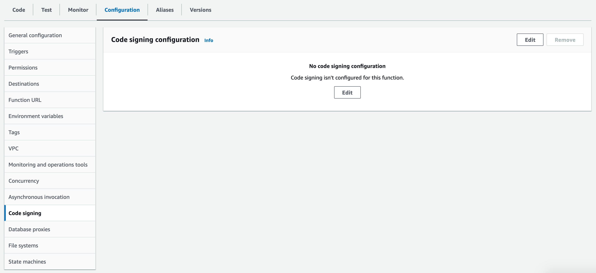

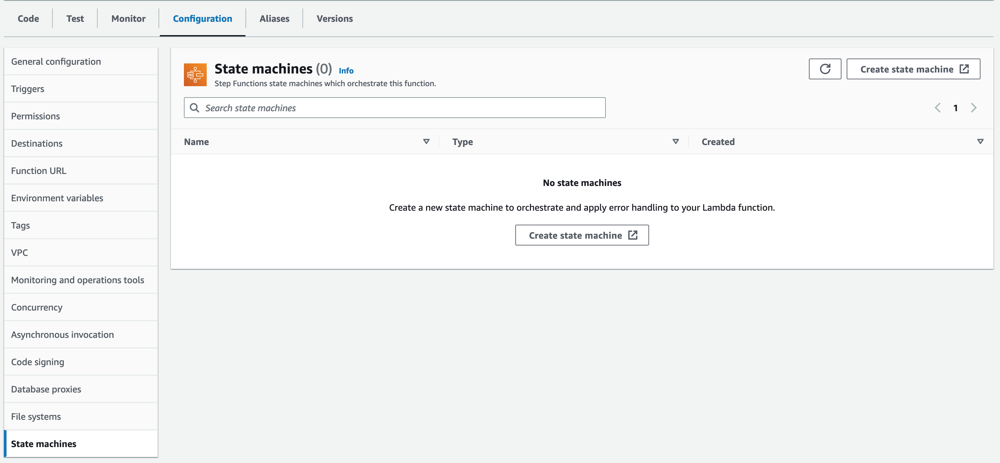

If everything has been set up correctly, the video transformation part is completed and running. To test the functioning of the architecture we can load a video in the input bucket and observe the list of Jobs present on MediaConvert. At the time of loading, a new Job in Progressing status will be initialized.
Please note that MediaConvert is not present in Milan as in many other places in the world, so it is necessary to observe its operation on 'us-east-1' (North Virginia). As soon as the job is completed you will see the box set to "Complete".

If we now look at the result on the output bucket we will see that a new folder named 'assets/' has been created inside it. Under the 'assets/' folder we will find all the names of the files that we have chosen to transform into the format of directories, where each of them contains the data stream. The stream consists of three folders, respectively, HLS, MP4, Thumbnails. As the names suggest HLS contains the data stream, MP4 contains a copy of the .mp4 file and Thumbnails contains a set of images sampled from the video which can be used as slideshow images in video thumbnails.
The HLS stream consists of a .m3u8 file which represents the index of the stream. It contains the various resolutions specified in the job, in our specific case 640x360, 960x540, 1280x720.

