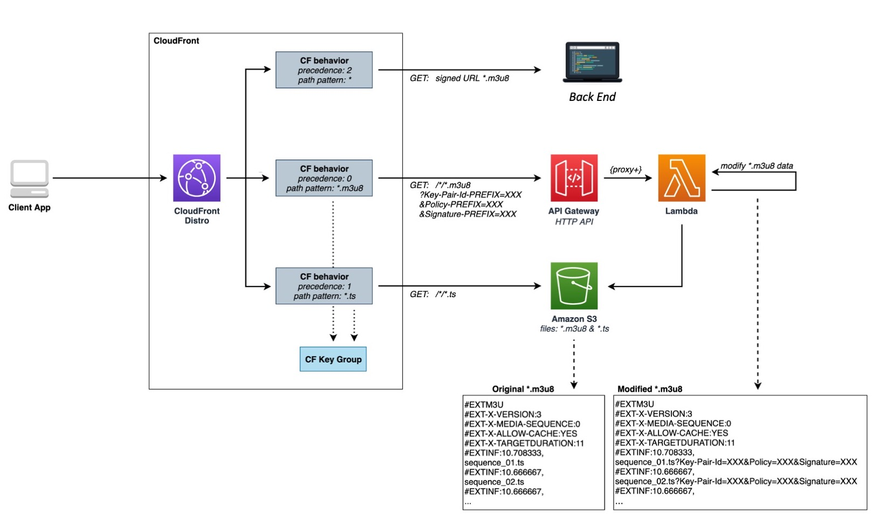
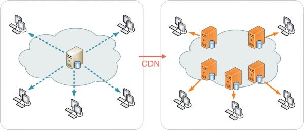

# Implementation in AWS

To complete the architecture and distribute the video streams, it is necessary to implement a security system that allows defining who can see the streams and who cannot. In particular, only those who have access to the platform must be able to have access. Therefore, through the back end it is necessary to certify that the requests are made only by people inside the platform. Once the user has been certified then he can get a video stream. The backend certification part will be treated here in a minimal way, as it is highly dependent on the type and way in which the platform itself is being developed. We will come back to this point later in this work and build our particular back end. Here we'll use some simple C# code to show how you can certify a request for a stream.
Once the user is certified, we will need a system that signs each package of our video stream.

Distribution in done through Cloudfront. Amazon CloudFront is a web service that accelerates the delivery of static and dynamic web content, such as image, .html, .css, and .js files, to your users. CloudFront delivers your content through a worldwide network of data centers called edge locations. When a user requests content that you distribute through Amazon CloudFront, the request is routed to the edge location that provides the lowest latency (delay) so that the distribution runs with the best possible performance.
If the content is already in the edge location with the lowest latency, Amazon CloudFront delivers it immediately.
If content is not found at such an edge location, Amazon CloudFront retrieves it from a user-defined origin, such as an Amazon S3 bucket, MediaPackage channel, or HTTP server (for example, a web server) that you identify as the origin of the definitive version of the contents.

From a logistical point of view, the problem can be broken down as follows.

