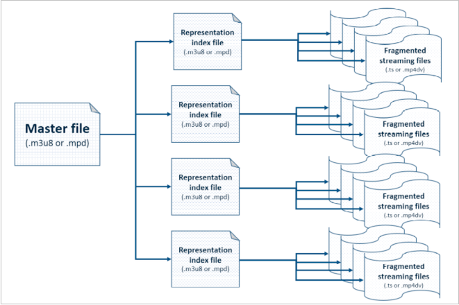
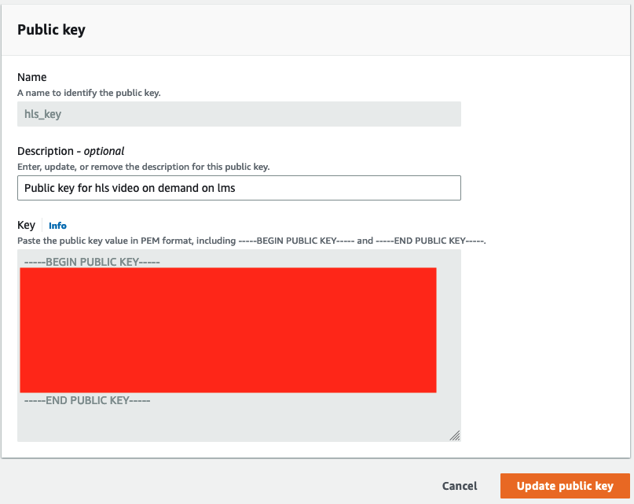

# Implementation in AWS

To complete the architecture and distribute the video streams, it is necessary to implement a security system that allows defining who can see the streams and who cannot. In particular, only those who have access to the platform must be able to have access. Therefore, through the back end it is necessary to certify that the requests are made only by people inside the platform. Once the user has been certified then he can get a video stream. The backend certification part will be treated here in a minimal way, as it is highly dependent on the type and way in which the platform itself is being developed. We will come back to this point later in this work and build our particular back end. Here we'll use some simple C# code to show how you can certify a request for a stream.
Once the user is certified, we will need a system that signs each package of our video stream.

## Cloudfront 

Distribution in done through Cloudfront. Amazon CloudFront is a web service that accelerates the delivery of static and dynamic web content, such as image, .html, .css, and .js files, to your users. CloudFront delivers your content through a worldwide network of data centers called edge locations. When a user requests content that you distribute through Amazon CloudFront, the request is routed to the edge location that provides the lowest latency (delay) so that the distribution runs with the best possible performance.
If the content is already in the edge location with the lowest latency, Amazon CloudFront delivers it immediately.
If content is not found at such an edge location, Amazon CloudFront retrieves it from a user-defined origin, such as an Amazon S3 bucket, MediaPackage channel, or HTTP server (for example, a web server) that you identify as the origin of the definitive version of the contents.

To use cloudfront you need to open the dedicated console on aws and create a new distribution.

Then you need to create a new origin, i.e. an access point from which cloudfront will fetch resources.

For "Origin Domain" select the output bucket where resources from mp4 to hls streams have been transformed.
For example, suppose the resource is the file named "mfo7a4nkarn4.m3u8" and the name of the distribution is "djr342o59fs". What we do is compose a string formed by the name of the distribution and the name of the resource.
https://djr342o59fs.cloudfront.net/assets/mfo7a4nkarn4/HLS/mfo7a4nkarn4.m3u8.

## .m3u8 analysis

Let's analyze once again the composition of a hls stream and take a closer look at how it works.

The framework we will use is Video.js. Video.js is a web video player built from the ground up for an HTML5 world. It supports HTML5 video and modern streaming formats, as well as YouTube, Vimeo, and even Flash.
It supports video playback on desktop and mobile devices.

Video.js initially asks for a resource, that in our case is the master .m3u8 file (mfo7a4nkarn4.m3u8). Once it is returned, it analyses the payload and it notices the presence of x different streams. 
    
    #EXTM3U #EXT-X-VERSION:3 
    #EXT-X-INDEPENDENT-SEGMENTS 
    #EXT-X-STREAM-INF:BANDWIDTH=236208,AVERAGE-BANDWIDTH=217847,CODECS="avc1.77.30,mp4a.40.2",RESOLUTION=640x360,FRAME-RATE=25.000 
    
    https://djr342o59fs.cloudfront.net/assets/mfo7a4nkarn4/HLS/mfo7a4nkarn4_360.m3u8
    
    #EXT-X-STREAM-INF:BANDWIDTH=316377,AVERAGE-BANDWIDTH=276030,CODECS="avc1.4d401f,mp4a.40.2",RESOLUTION=960x540,FRAME-RATE=25.000 
    
    https://djr342o59fs.cloudfront.net/assets/mfo7a4nkarn4/HLS/mfo7a4nkarn4_540.m3u8
    
    #EXT-X-STREAM-INF:BANDWIDTH=386071,AVERAGE-BANDWIDTH=327974,CODECS="avc1.4d401f,mp4a.40.2",RESOLUTION=1280x720,FRAME-RATE=25.000 
    
    https://djr342o59fs.cloudfront.net/assets/mfo7a4nkarn4/HLS/mfo7a4nkarn4_720.m3u8

All the streams represent the same resource, but in a different resolution. Computing and evaluating the status of the net, it decides that HD is the best way for displating the video without lags, so it selects the resource mfo7a4nkarn4_720.m3u8. So it asks for the mfo7a4nkarn4_720.m3u8 resource and it gets back the list of .ts file representing the resource. 

    #EXTM3U 
    #EXT-X-VERSION:3 
    #EXT-X-TARGETDURATION:12 
    #EXT-X-MEDIA-SEQUENCE:1 
    #EXT-X-PLAYLIST-TYPE:VOD 
    #EXTINF:11, 
    
    https://djr342o59fs.cloudfront.net/assets/mfo7a4nkarn4/HLS/000001.ts
    #EXTINF:11,  
    https://djr342o59fs.cloudfront.net/assets/mfo7a4nkarn4/HLS/000002.ts
    #EXTINF:10,  
    https://djr342o59fs.cloudfront.net/assets/mfo7a4nkarn4/HLS/000003.ts
    #EXTINF:11, 
    https://djr342o59fs.cloudfront.net/assets/mfo7a4nkarn4/HLS/000004.ts
    #EXTINF:11, 
    https://djr342o59fs.cloudfront.net/assets/mfo7a4nkarn4/HLS/000005.ts
    #EXTINF:11, 
    https://djr342o59fs.cloudfront.net/assets/mfo7a4nkarn4/HLS/000006.ts
    #EXTINF:5,  
    https://djr342o59fs.cloudfront.net/assets/mfo7a4nkarn4/HLS/000007.ts
    #EXT-X-ENDLIST

It now asks to cloudfront only a subset of the .ts files, i.e. the ones it needs for the first few minutes of the video file. As the video progresses, it will also request the next ones.

## Signed url
The problem here is that anyone, knowing the distribution and filename, is able to get the resources. We don't want this to happen as we are building a pay to watch service, or an internal service that only a subset of people need access to.

An hls video stream can therefore be summarized as follows:
1) index file request
2) request for the file containing the specific resolution
3) Queue request for .ts files

To request the first file, i.e. the index file, we need to sign our first request. This is done in the backend.

When you sign a resource using signed urls, what you do is compose a string with three parameters:
- Expires
- Signature
- Key Pair

Here we can see an example of the result:

https://djr342o59fs.cloudfront.net/assets/mfo7a4nkarn4/HLS/mfo7a4nkarn4.m3u8?Expires=1673003935&Signature=sdsasdasdagegekHEsYUbRnNpqm7TCY~BPaZ1nH8UgEBDdhwertwr4fdhro1SVVBFeFEy94LMJTJnxuSJTKK0gQgYNOdwzMX7BoaK0V~zm5odnzClaVjDXUi3XEem9nDkMQDxk5LcxoPWTvvGAPrSByqBsBVNbpuMX5YPn~jmyYWBiKyIahopNVDaer0IfbEk4XE5X6auEXCBoDAEDlngUhrDZCrTEXhth5EgS3y-wxmNXHy7kWCT3x-60xOUzpfwEDk9223ampi8Oc0SUqV3WI~JKSORWocKWkXnPPHSltz5MZSBFQ0yQ2iKpmz9lSI7IPrKoExXE9AShc-g__&Key-Pair-Id=K45JNTO2BIFA51

Expires shows as long as the resource will remain valid, Signature contains the signature to be validated and Key-Pair-Id instead contains the indication of the private public key pair to be recovered in the cloudfront configuration.
In fact, if you want to use signed urls, you must first set the key pair in cloudfront that will be used for validation.
For generating the key-pair id is possible to use the 2048 bit RSA with openssl.
The private key will be saved in the backend, to sign the first requests and then in the future lambda we will create, to sign the file .m3u8 and .ts.
The public key will be saved on cloudfront.
So, going in cloudfront, you see in the dashboard "key management -> public keys".

Then, it is mandatory to go in the "key management -> public groups" and create a new key group.

We have implemented the request to the backend, now the package is signed and cloudfront is able to consume the request. However we have not yet determined the response we want cloudfront to return to us.

As shown in architecture, we need to recover our .m3u8 file. However we must not only recover it, but we must also modify its content. In fact, as explained above, it contains the url to the resources that will be needed later. Cloudfront is obviously unable to do this. We then use a lambda function, which will fetch the file and modify it for us. However, merging a Lambda function with a service like Cloudfront is also impossible, as you need a bridge between them. You can use API gateway. AP-GTW is a service that allows you to create APIs, which can therefore be called through a link.
The procedure will then be like the one in the figure above. Cloudfront will consume the parameters listed above (expires-signature-keypairid) and validate the request, if so it will call the dedicated API on AP-GTW passing it the resource you want to obtain in query. The api will be defined through a lambda function.

We then create a new api in AP-GTW

The api will be attached to a lambda. We define a new lambda function, written in python to do so.

The code is the following

        import os, sys
        import subprocess
        import multiprocessing as mp

        # pip install custom package to /tmp/ and add to path
        subprocess.call('pip install cryptography==36.0.0 -t /tmp/ --no-cache-dir'.split(), 
        stdout=subprocess.DEVNULL, stderr=subprocess.DEVNULL)
        sys.path.insert(1, '/tmp/')
        import json
        import boto3
        import datetime
        import time
        from cryptography.hazmat.backends import default_backend
        from cryptography.hazmat.primitives import hashes
        from cryptography.hazmat.primitives import serialization
        from cryptography.hazmat.primitives.asymmetric import padding
        from botocore.signers import CloudFrontSigner

        def lambda_handler(event, context):
            print(mp.cpu_count())
            path = event['queryStringParameters']['hour']
            path_splitted = path.split("/")
            
            ASSETS = path_splitted[1]
            HASH_DIR = path_splitted[2]
            HLS = path_splitted[3]
            FILE = path_splitted[4]
            
            # retrieve element from the bucket 
            s3Client = boto3.client(
                's3',
                region_name='eu-south-1'
                )
                
            bucketName = 'output-bucket-terraform-lms-hls-streaming'
            
            file_to_read_base = '' + ASSETS + '/' + HASH_DIR + '/' + HLS + '/'
            file_to_read_init = file_to_read_base + FILE
            file_content = s3Client.get_object(Bucket=bucketName, Key=file_to_read_init)["Body"].read().decode('utf-8')
            
            lines = file_content.split('\n')
            counter = 0
            
            key_id = 'K1************'
            urlCloudfront = 'https://d1r***********.cloudfront.net/'

            expire_date = datetime.datetime.now() + datetime.timedelta(days=1)
            cloudfront_signer = CloudFrontSigner(key_id, rsa_signer)
            for i in range(len(lines)):
                line = lines[i]
                '''
                print("line {0} -> {1}".format(counter, line))
                counter += 1
                '''
                
                # sign elements in the file if it doesn't start with #
                if len(line)>0:
                    if line[0] != '#':
                        # sign
                        line = cloudfront_signer.generate_presigned_url(
                            urlCloudfront + file_to_read_base + line, 
                            date_less_than=expire_date)
                        print(line)
                
                lines[i] = line
                
            # recompose the string
            file_content = ''
            for line in lines: file_content += (line + '\n')
            # return the elements
            return {
                'statusCode': 200,
                'headers' : {
                    "Content-Type" : "audio/mpegurl"  
                },
                'body': file_content
            }

        def rsa_signer(message):
            with open('private_key.pem', 'rb') as key_file:
                private_key = serialization.load_pem_private_key(
                    key_file.read(),
                    password=None,
                    backend=default_backend()
                )
            signed = private_key.sign(message, padding.PKCS1v15(), hashes.SHA1())
            return signed

The settings of the lambda function are :
